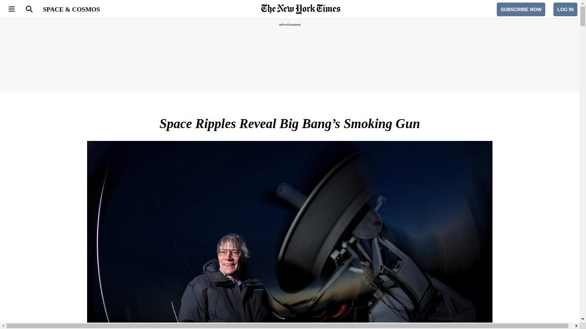
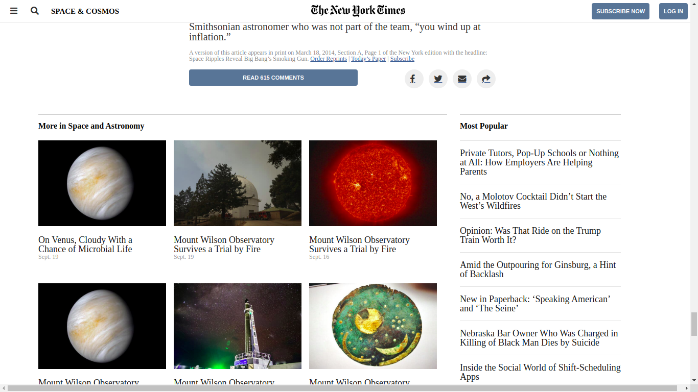

# Positioning and Floating Elements

> article page that matches the appearance of NYtimes article

## Built With

- HTML5
- CSS3

## Live Demo

[Live Demo Link](https://raw.githack.com/zdrale/NyTimesClone/Space-and-cosmos/index.html)

## Authors

👤 **Binyam Hailemeskel**

- GitHub: [@bini-i](https://github.com/bini-i)
- Twitter: [@binyamshewa](https://twitter.com/binyamshewa)
- LinkedIn: [LinkedIn](https://www.linkedin.com/in/binyam-hailemeskel-728048151/)

👤 **Nikola Zdrale**

- GitHub: 
- Twitter: 
- LinkedIn: 

## 🤝 Contributing

Contributions, issues, and feature requests are welcome!

Feel free to check the [issues page](issues/).

## Show your support

Give a ⭐️ if you like this project!

## Acknowledgments

- Nytimes

## 📝 License

This project is [MIT](lic.url) licensed.
